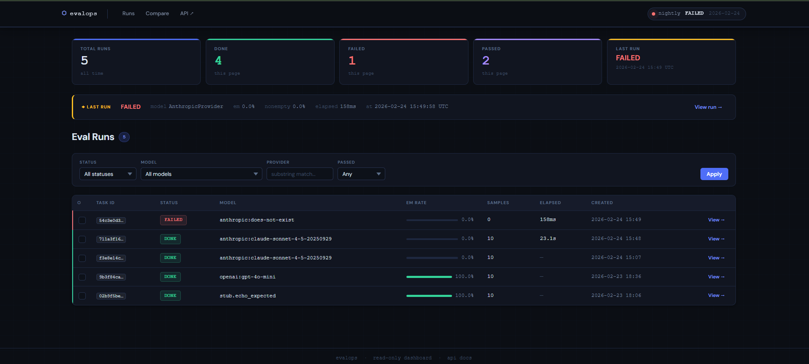
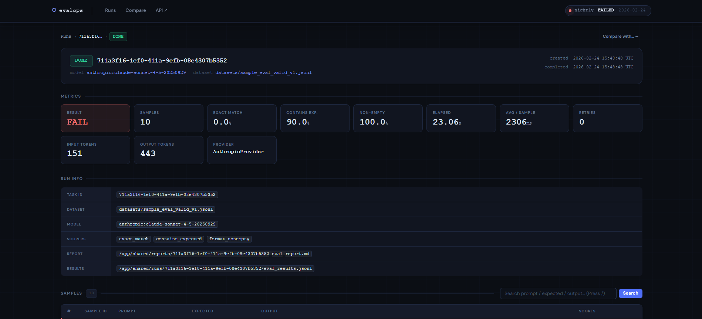
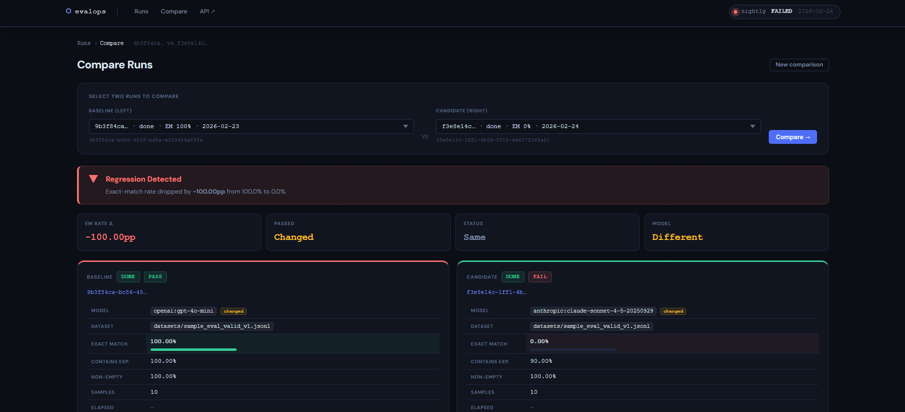
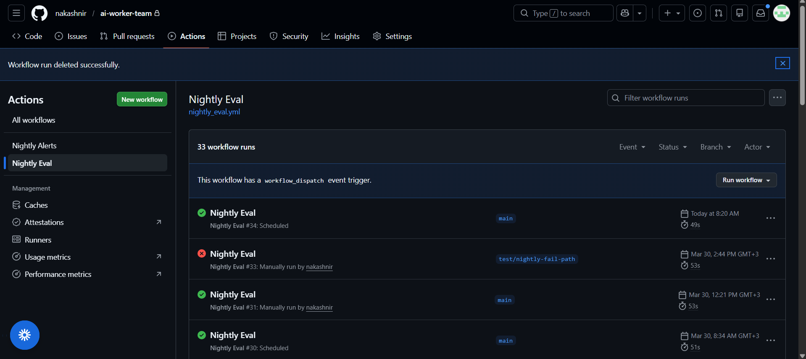
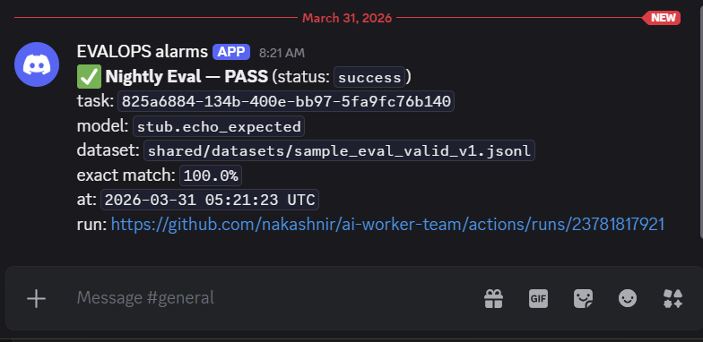

# ai-worker-team

**Production-inspired EvalOps infrastructure for LLM quality regression detection.**

`ai-worker-team` is a complete evaluation operations system that runs structured LLM evaluation jobs, detects quality regressions, and surfaces diagnostic insights through an integrated dashboard and automated CI workflows. Built to demonstrate operational approaches for teams shipping LLM-backed features.

## Problem Statement

Teams shipping LLM-backed features face three critical operational questions:
1. **Did quality regress?** — Automated detection of performance degradation
2. **Where did it regress?** — Diagnostic visibility into failure patterns and root causes
3. **How quickly can we surface it?** — Nightly CI integration with webhook alerts

Most teams have partial tooling (scattered scripts, manual comparisons, ad-hoc evaluations) but lack a unified operational workflow for running evals, storing outcomes, analyzing regressions, and routing alerts.

## What the System Does

- Runs evaluation tasks against configured models/providers.
- Persists run-level and sample-level results.
- Writes artifacts for reports and run history.
- Exposes dashboard views for run inspection and run-to-run comparison.
- Executes nightly regression checks in GitHub Actions.
- Sends webhook-based nightly alerts, including Discord-compatible notifications.

## Architecture

The system uses a task queue architecture with persistent storage and CI integration:

```
┌─────────────┐      ┌──────────────┐      ┌─────────────┐
│   Client    │─────▶│ Orchestrator │◀────▶│  Dashboard  │
│  (Submit)   │      │   (FastAPI)  │      │   (Web UI)  │
└─────────────┘      └──────────────┘      └─────────────┘
                            │
                            ▼
                     ┌──────────────┐
                     │    Redis     │
                     │  (Queue)     │
                     └──────────────┘
                            │
                            ▼
                     ┌──────────────┐      ┌─────────────┐
                     │   Workers    │◀────▶│  Providers  │
                     │  (Eval Exec) │      │ (LLM APIs)  │
                     └──────────────┘      └─────────────┘
                            │
                            ▼
                     ┌──────────────┐
                     │  PostgreSQL  │
                     │  (Results)   │
                     └──────────────┘
                            │
                            ▼
                     ┌──────────────┐      ┌─────────────┐
                     │GitHub Actions│─────▶│  Webhooks   │
                     │  (Nightly)   │      │  (Alerts)   │
                     └──────────────┘      └─────────────┘
```

**Components:**

- **Orchestrator**: FastAPI service exposing task submission API and dashboard UI
- **Workers**: Background execution service that runs evaluations and computes metrics
- **Providers**: LLM integration layer with fallback handling (Anthropic, OpenAI)
- **PostgreSQL**: Persistent storage for run results, metrics, and sample-level data
- **Redis**: Task queue and coordination layer
- **Dashboard**: Read-only web UI for run inspection and comparison
- **GitHub Actions**: Scheduled nightly regression workflow with webhook alerting

For detailed architecture documentation, see [docs/ARCHITECTURE.md](docs/ARCHITECTURE.md).

**Development Workflow:**

For information on the repository workflow, development stages (Builder → QA → Verification → Codex), and the distinction between the repository tree and live tree, see [docs/WORKFLOW.md](docs/WORKFLOW.md).

## Core Workflows

1. Submit an eval task.
2. Worker executes samples and computes metrics.
3. Results and artifacts are written to storage.
4. Dashboard surfaces run details and comparison views.
5. Nightly workflow executes regression checks and emits alerts.

## Core Capabilities

**Evaluation Execution**
- Multi-provider LLM evaluation with fallback handling (Anthropic, OpenAI)
- Deterministic scorers (exact match, contains expected, non-empty validation)
- LLM-as-judge evaluator with structured verdict extraction
- Sample-level and run-level metric aggregation

**Quality Diagnostics**
- Failure taxonomy classification (hallucination, incomplete answer, format errors, provider errors)
- Verdict quality metrics (judge pass rate, valid verdict rate)
- Category-level failure aggregation and top failure identification
- Backward-compatible metric rendering for runs with/without taxonomy

**Regression Detection**
- Run-to-run comparison with delta visualization
- Taxonomy-aware compare views (judge pass rate deltas, top failure category changes)
- Automated nightly regression checks via GitHub Actions
- Pass/fail verdict alignment with configurable thresholds

**Operational Visibility**
- Web dashboard for run inspection and historical comparison
- Sample-level drill-down with evaluator verdict details
- Nightly webhook alerts with regression summaries (Discord-compatible)
- Artifact persistence (JSON reports, run history, sample details)

## Screenshots

**Dashboard: Run History and Filtering**

Browse evaluation runs with status, model, pass/fail verdict, and metric summaries. Filter by status, model, or time range.



**Run Detail: Sample-Level Diagnostics**

Drill down into individual runs to inspect sample-level results, evaluator verdicts, failure categories, and LLM judge reasoning.



**Compare Runs: Regression Analysis**

Side-by-side comparison of two eval runs showing metric deltas, top failure category changes, and judge pass rate improvements/regressions.



**GitHub Actions: Nightly Automation**

Automated nightly regression checks run on schedule, execute baseline evaluations, and upload artifacts for dashboard inspection.



**Discord Alerts: Regression Notifications**

Webhook-based alerts notify teams of regression status, including pass/fail verdict, metric deltas, and links to run details.



## Repository Structure

```text
.
├── orchestrator/        # API service + dashboard templates/static
├── workers/             # background worker execution logic
├── providers/           # model/provider integrations and fallback handling
├── schemas/             # task/result schema contracts
├── ops/sql/             # database schema/init SQL
├── scripts/             # local workflow utilities and regression checks
├── .github/workflows/   # nightly CI workflows
├── docs/                # public docs/runbooks
├── baselines/           # regression baseline contracts
└── shared/              # datasets and runtime artifact directories
```

## Tech Stack

**Backend:**
- Python 3.11+ with type hints and strict validation
- FastAPI + Uvicorn for API and dashboard serving
- Pydantic for schema validation and serialization
- PostgreSQL for persistent result storage
- Redis for task queue and coordination

**Frontend:**
- Jinja2 templates with server-side rendering
- Vanilla JavaScript for interactive features
- CSS with design system tokens

**Infrastructure:**
- Docker Compose for local development
- GitHub Actions for CI/CD and nightly workflows
- Webhook integration for alerting (Discord-compatible)

**Evaluation:**
- Multi-provider LLM integration (Anthropic Claude, OpenAI)
- Structured JSON output parsing for LLM-as-judge
- Deterministic scorers for baseline metrics

## How to Run Locally

```bash
# 1) Clone and enter repository
cd /path/to/ai-worker-team-repo

# 2) Create .env (example values)
cat > .env <<'ENV'
POSTGRES_USER=postgres
POSTGRES_PASSWORD=postgres
POSTGRES_DB=ai_workers
ANTHROPIC_API_KEY=
OPENAI_API_KEY=
DEFAULT_ANTHROPIC_MODEL=claude-sonnet-4-5-20250929
ENV

# 3) Start stack
docker-compose up -d

# 4) Initialize schema
docker-compose exec -T postgres \
  psql -v ON_ERROR_STOP=1 -U postgres -d ai_workers \
  < ops/sql/001_evalops.sql

# 5) Run nightly regression script locally
./scripts/run_nightly_local.sh
```

## GitHub Actions / Nightly Usage

- `nightly_eval.yml` schedules regression execution and artifact upload.
- `nightly-alerts.yml` listens for nightly completion and sends webhook alerts.
- Alerting is non-fatal by design; regression workflows continue even if webhook delivery fails.

For operational details, see:

- `RUNBOOK.md`
- `docs/runbooks/nightly-alerts.md`

## Configuration / Env

Primary environment variables used across services/workflows:

- `POSTGRES_USER`
- `POSTGRES_PASSWORD`
- `POSTGRES_DB`
- `REDIS_URL`
- `SHARED_DIR`
- `ANTHROPIC_API_KEY`
- `OPENAI_API_KEY`
- `DEFAULT_ANTHROPIC_MODEL`
- `ALERT_WEBHOOK_URL`
- `ALERT_ON_SUCCESS`

## Current Scope & Limitations

**What's Built:**
- Production-inspired EvalOps infrastructure with persistent storage and CI integration
- LLM-as-judge evaluator with failure taxonomy classification
- Taxonomy-aware comparison views with diagnostic deltas
- Automated nightly regression detection with webhook alerts
- Backward-compatible metric rendering for legacy runs

**Intentional Limitations:**
- **Analytics**: Run-level comparisons and nightly checks are primary; dedicated trend dashboards for long-horizon analysis are not yet implemented
- **Scoring**: Focused on current regression workflows; broader rubric coverage and custom scorer frameworks are in progress
- **Alerting**: Webhook-first design with Discord compatibility; advanced routing, escalation policies, and multi-channel delivery are future work
- **Taxonomy**: Fixed failure category set; custom taxonomies per evaluator or domain are not yet supported

**Design Decisions:**
- Read-only dashboard (no in-UI task submission) to maintain clear operational boundaries
- Alerting is non-fatal by design; regression workflows continue even on webhook failure
- Sample-level data persisted for diagnostics but not exposed in public API endpoints

## Future Work

- Expand benchmark datasets and scorer coverage.
- Harden deployment packaging and environment profiles.
- Add richer observability and trend visualization.
- Add more complete contributor and operations documentation.

## License

This project is licensed under the MIT License. See [LICENSE](LICENSE).
